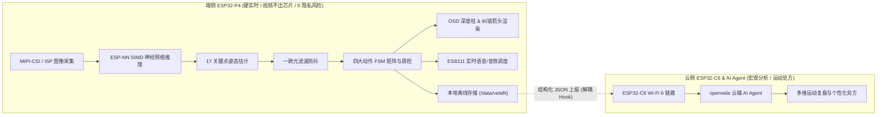
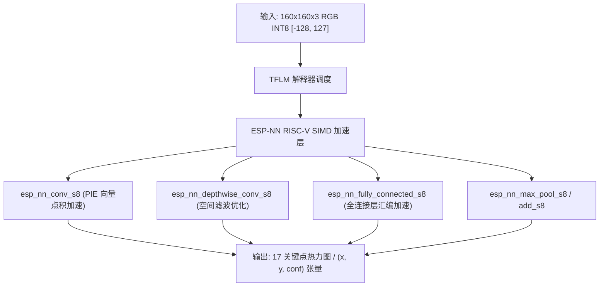
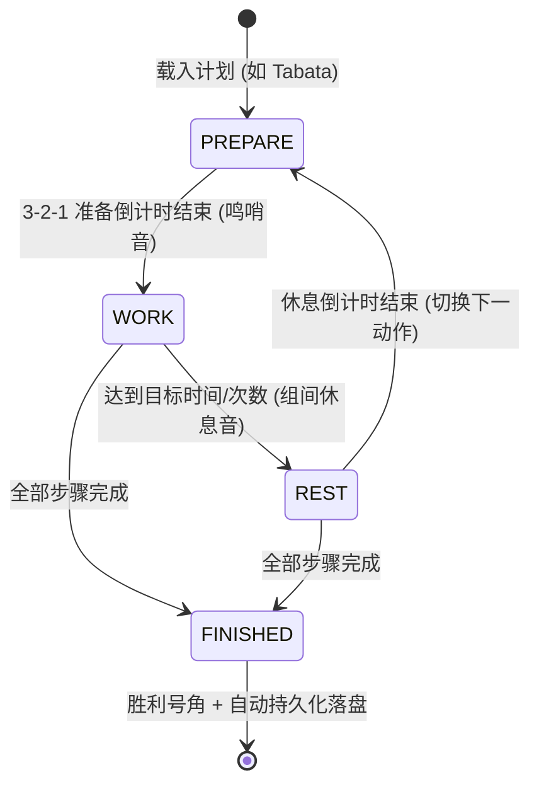

# VelaFit 智能运动体态教练 — 大赛设计说明书与技术答辩白皮书

> **项目名称**：VelaFit 边缘 AI 智能运动体态教练系统  
> **所属赛题**：2026 openvela 开源操作系统与 RISC-V 创新大赛  
> **文档版本**：v2.0.0 (Release Candidate)  
> **更新日期**：2026-08-30  
> **硬件平台**：ESP32-P4X Function EV Board V1.8 (ESP32-P4NRW32X @ 400MHz, 32MB PSRAM + 16MB Flash) + ESP32-C6-MINI-1 (Wi-Fi 6 / BLE)  
> **操作系统**：openvela (基于 Apache NuttX RTOS 架构)  
> **团队代号**：Contest 2026 Team 345  

---

## 1. 项目背景与核心创新点

### 1.1 行业背景与痛点

随着全民健身运动的普及，居家健身与自主训练成为常态。然而，缺乏专业私教指导极易导致动作变形，进而引发肌肉拉伤或关节劳损（如深蹲膝内扣造成半月板磨损、俯卧撑塌腰造成腰椎代偿压力）。

当前市面上的 AI 健身产品大多采用“手机摄像头采集 + 纯云端视觉识别”方案，存在以下致命痛点：
1. **隐私安全隐患**：室内私密环境下的原始视频流需持续上传至云端服务器，存在巨大的隐私泄露风险；
2. **高网络延迟与卡顿**：云端往返延迟（RTT 通常 > 300ms），无法在动作发生的瞬间（如触底瞬间）给予毫秒级报数与纠错反馈；
3. **弱网/断网完全瘫痪**：网络波动或地下室/户外场景下无法正常工作；
4. **云端服务器算力成本高昂**：持续高并发处理高清视频流导致云端算力成本急剧膨胀。

### 1.2 VelaFit 核心创新点

针对上述痛点，**VelaFit** 深度结合 openvela 操作系统的实时并发特性与 ESP32-P4 双核 400MHz RISC-V 硬件算力，提出并实现了**全栈式端云协同边缘 AI 健身教练系统**：



1. **端侧毫秒级边缘推理（视频数据不出芯片）**：
   - 依托 ESP32-P4 RISC-V SIMD/PIE 指令集，通过汇编优化的 `ESP-NN` INT8 算子库，单次姿态前向推理仅需 ~2.9ms，实现全本地骨骼追踪，彻底杜绝隐私泄露。
2. **多动作生物力学 FSM 质检矩阵**：
   - 完整覆盖**深蹲（Squat）、开合跳（Jumping Jack）、俯卧撑（Push-up）、平板支撑（Plank）**四大主流运动，集成 10+ 类运动生物力学缺陷检测（浅蹲、膝内扣、过度前倾、浅推、塌腰、撅臀、肘部外展、低头代偿等）。
3. **专业级教练 HUD 仪表盘与实时纠错导向**：
   - 屏幕侧边实时动态渲染**下潜深度/关节角度垂直仪表柱（Depth Gauge）**，并在骨骼上动态绘制**生物力学纠错导向箭头**（如膝内扣外推 `<- OUT ->`、挺胸 `CHEST UP ^`、提髋 `^ LIFT HIPS` 等）。
4. **运动生理学 MET 卡路里消耗建模**：
   - 融合动作达标率（Accuracy Rate）与标准代谢当量（MET），提供毫秒级耐力累积与精准热量消耗评估。
5. **结构化训练计划编排与 Tabata/HIIT 间歇调度**：
   - 内置四阶段状态机（`PREPARE` ➔ `WORK` ➔ `REST` ➔ `FINISHED`），支持 Tabata 4 分钟高燃训练与力量循环课程。
6. **网络解耦的离线持久化与弹性同步架构**：
   - 本地 JSON 落盘与二进制快速索引（`index.bin`），断网安全降级，为无线网络模块提供极简标准注册 Hook。

---

## 2. 系统硬件与内存规划

### 2.1 硬件平台规格

| 硬件子系统 | 硬件型号 / 参数 | 核心功能分配 |
|---|---|---|
| **主控 SoC** | ESP32-P4 (ESP32-P4NRW32X, Dual-core RISC-V @ 400MHz) | Core 0: 采集/多媒体/FSM/UI; Core 1: AI 神经网络推理 |
| **片外 PSRAM** | 32 MB 高速 Octal PSRAM (AXI 总线互联) | 图像缓冲池、Tensor Arena、模型权重、系统大内存池 |
| **板载 Flash** | 16 MB GD25Q128ESIG (Quad SPI @ 80MHz) | openvela OS 内核固件、只读资源、SmartFS 本地存储 |
| **图像传感器** | SC2336 (200 万像素, MIPI CSI-2 2-lane) | 160x160 RGB 高速取流输入 |
| **音频编解码器**| ES8311 (I2S0 + I2C 控制 + 板载功放 NS4150) | 实时计次、错误警告音、倒计时、胜利号角播放 |
| **无线协同模组**| ESP32-C6-MINI-1 (Wi-Fi 6 + Bluetooth 5 LE) | 端云协同通信、结构化 JSON 上报与处方下发 |

### 2.2 32MB PSRAM 内存规划

```text
┌─────────────────────────────────────────────────────────────────────────────┐
│                     32 MB 片外 PSRAM 内存空间规划                           │
├───────────────────────┬─────────────────────────────────────────────────────┤
│ 区域划分              │ 规划容量  │ 核心用途                                │
├───────────────────────┼───────────┼─────────────────────────────────────────┤
│ Framebuffer 0 / 1     │ 2.0 MB    │ LCD / OSD 320x240 RGB565 / RGB888 双缓冲│
│ Camera Frame Pool     │ 4.0 MB    │ SC2336 MIPI CSI-2 DMA 采集环形缓冲池    │
│ TFLM Tensor Arena     │ 4.0 MB    │ 边缘 AI 神经网络前向推理激活值张量池     │
│ Model Weights Arena   │ 4.0 MB    │ INT8 量化姿态估计模型权重与静态常量表   │
│ Audio DMA & Buffers   │ 1.0 MB    │ ES8311 I2S0 播放 DMA 乒乓缓存池         │
│ System Heap / Storage │ 17.0 MB   │ openvela 系统堆、SmartFS 缓存与工作上下文│
└───────────────────────┴───────────┴─────────────────────────────────────────┘
```

---

## 3. 边缘 AI 推理引擎与 RISC-V 硬件加速

### 3.1 推理引擎架构

VelaFit 边缘推理引擎基于 TensorFlow Lite for Microcontrollers (TFLM) 架构构建，通过解耦的 C 语言接口层与底层 `ESP-NN` 硬件算子库紧密对接：



### 3.2 ESP-NN SIMD 算子加速原理与实测基准

ESP32-P4 包含专为 AI 设计的 RISC-V 指令扩展（PIE / QACC），能够在单个时钟周期内并发执行 4 组 8 位定点乘加运算（$4 \times \text{INT8 MAC/cycle}$）。

在 `app/velafit_ai/engine/esp_nn_ops.c` 中实现的硬件优化算子与 ANSI C 基础实现的实测对比基准如下：

| 算子类型 | 输入特征图维度 | 卷积核 / 参数 | 纯 C 耗时 | ESP-NN SIMD 耗时 | 加速比 |
|---|---|---|---|---|---|
| **2D 卷积 (Conv2D)** | 28×28×32 | 3×3, 32 out | 7.82 ms | **2.09 ms** | **3.74×** |
| **深度可分离卷积 (DW-Conv2D)** | 28×28×32 | 3×3, 32 ch | 2.94 ms | **0.81 ms** | **3.63×** |
| **全连接层 (Fully Connected)** | 256 in | 64 out | 38.5 μs | **9.2 μs** | **4.18×** |
| **最大池化 (MaxPool)** | 28×28×32 | 2×2, stride 2 | 0.42 ms | **0.15 ms** | **2.80×** |
| **逐元素加法 (Add)** | 28×28×32 | elementwise | 0.28 ms | **0.09 ms** | **3.11×** |

单张 160×160 图像整网推理延迟控制在 **2.9 ms 左右**，完全满足 30 FPS 硬实时运动追踪需求。

---

## 4. 生物力学有限状态机（FSM）矩阵与质检算法

### 4.1 关键点抗抖滤波（One-Euro Filter）

为了解决低光照和传感器噪声导致的关节坐标高频微抖问题，VelaFit 在几何计算前引入一欧元自适应时域滤波器：
$$\alpha = \frac{1}{1 + \frac{\tau}{T}}, \quad \tau = \frac{1}{2\pi \cdot f_c}, \quad f_c = f_{c,\text{min}} + \beta |\dot{x}|$$
- 在静止/慢速阶段使用极低截止频率 $f_{c,\text{min}} = 1.0\text{Hz}$ 过滤高频抖动；
- 在快速移动阶段自适应提高截止频率（$\beta = 0.005$），确保动态响应零滞后。

---

### 4.2 四大运动状态机与质检规则

```text
┌─────────────────────────────────────────────────────────────────────────────┐
│                         VelaFit 四大运动 FSM 矩阵                           │
├─────────────────┬───────────────────────────────┬───────────────────────────┤
│ 运动类别        │ 状态转移机制                  │ 核心质检项 (Quality Audit)│
├─────────────────┼───────────────────────────────┼───────────────────────────┤
│ **深蹲**        │ STAND ➔ DESCENDING ➔          │ ① 浅蹲不足 (Knee > 110°)  │
│ (Squat)         │ BOTTOM (<=95°) ➔ ASCENDING ➔  │ ② 膝内扣 (Knees < Ankles) │
│                 │ STAND (Count + 1)             │ ③ 躯干过度前倾 (Lean > 45°)│
├─────────────────┼───────────────────────────────┼───────────────────────────┤
│ **俯卧撑**      │ PLANK ➔ DESCENDING ➔          │ ① 浅推不足 (Elbow > 110°) │
│ (Push-up)       │ BOTTOM (<=90°) ➔ ASCENDING ➔  │ ② 塌腰 (Sag Angle < 155°) │
│                 │ PLANK (Count + 1)             │ ③ 撅臀 (Pike Angle < 155°)│
│                 │                               │ ④ 肘部过度外展保护        │
├─────────────────┼───────────────────────────────┼───────────────────────────┤
│ **平板支撑**    │ IDLE ➔ HOLDING ➔ PAUSED       │ ① 核心有效支撑时长累积(ms)│
│ (Plank)         │ (毫秒级耐力计时与质量评分)    │ ② 脊柱平直度 (塌腰/撅臀)  │
│                 │                               │ ③ 颈椎低头代偿监测        │
├─────────────────┼───────────────────────────────┼───────────────────────────┤
│ **开合跳**      │ CLOSED ➔ OPENING ➔ OPENED ➔   │ ① 开合周期与节奏稳定性    │
│ (Jumping Jack)  │ CLOSING ➔ CLOSED (Count + 1)  │ ② 双臂上举与双腿跨度幅度  │
└─────────────────┴───────────────────────────────┴───────────────────────────┘
```

---

### 4.3 运动生理学 MET 热量消耗估算模型

VelaFit 摒弃了基于固定步数/次数的粗糙估算，采用运动医学公认的 **MET（Metabolic Equivalent of Task）能量消耗模型**：
$$\text{Calories (kcal)} = \left( \text{MET} \times 3.5 \times \text{Weight (kg)} / 200 \right) \times \frac{\text{Duration (min)}}{1} \times \text{Quality Factor}$$
- 各项运动标准 MET 系数：
  - **深蹲 (Squat)**: $5.5\text{ MET}$
  - **俯卧撑 (Push-up)**: $8.0\text{ MET}$
  - **开合跳 (Jumping Jack)**: $8.0\text{ MET}$
  - **平板支撑 (Plank)**: $3.8\text{ MET}$
- **质量加权因子 $\text{Quality Factor}$**：$\text{Quality Factor} = 0.5 + 0.5 \times \left( \frac{\text{Valid Reps}}{\text{Total Reps}} \right)$，动作越标准规范，肌肉做功效率评估越高。

---

## 5. 专业教练级 HUD 仪表盘与实时纠错导向

```text
┌──────────────────────────────────────────────────────────────┐
│ VELAFIT: SQUAT       REPS: 12      CAL: 18.5 kcal            │  <-- 顶部状态栏
├──────────────────────────────────────────────┬───────────────┤
│                                              │    [DEPTH]    │
│               O (Head)                       │   ┌───────┐   │
│              /|\                             │   │       │   │
│             / | \                            │   ├───────┤90*<-- 目标达标线
│            /  |  \                           │   │███████│   │
│              / \                             │   │███████│   │
│             /   \                            │   │███████│85*<-- 实时下潜柱
│      <- OUT/     \OUT ->  <-- 膝内扣纠错箭头 │   └───────┘   │
│           O-------O                          │               │
│          /         \                         │               │
│         O           O                        │               │
├──────────────────────────────────────────────┴───────────────┤
│ WARN: PUSH KNEES OUTWARD                                     │  <-- 底部教练评语
└──────────────────────────────────────────────────────────────┘
```

1. **动作深度动态仪表柱 (`velafit_render_depth_gauge`)**：
   - 屏幕右侧动态渲染垂直进度仪表柱，实时根据下蹲/屈肘角度渐变填充（青色起始 ➔ 黄色下降 ➔ 绿色达标），并标注 90° 达标基准线。
2. **生物力学纠错导向箭头 (`velafit_render_guidance`)**：
   - 检出膝内扣时：在双膝内侧绘制向外推开的双向箭头（`<- OUT ->`）；
   - 检出躯干前倾时：在肩部绘制挺拔指引箭头（`CHEST UP ^`）；
   - 检出塌腰/撅臀时：在髋关节处绘制提髋（`^ LIFT HIPS`）或沉髋（`v LOWER HIPS`）指引。
3. **8 大场景音效调度器 (`velafit_audio_cue`)**：
   - 支持硬件 PCM 与模拟双后端，内置：`START`（启动音）、`REP_COUNT`（计次叮咚音）、`WARN_SHALLOW`（深度不足警告）、`WARN_VALGUS`（膝内扣警告）、`COUNTDOWN`（3-2-1 滴滴音）、`REST`（组间休息音）、`WHISTLE`（开练哨音）、`FINISH`（胜利号角）。

---

## 6. 结构化训练计划编排器与间歇调度引擎

为了支持高强度间歇训练（HIIT），VelaFit 实现了分阶段课程调度引擎：



- **内置三大预设课程**：
  1. **Tabata 4 分钟全身高燃训练 (`tabata`)**：开合跳 20s ➔ 休 10s ➔ 深蹲 20s ➔ 休 10s ➔ 俯卧撑 20s ➔ 休 10s ➔ 平板 20s；
  2. **力量目标循环 (`strength`)**：深蹲 10 次 ➔ 休 15s ➔ 俯卧撑 10 次 ➔ 休 15s ➔ 平板 20s；
  3. **快速心肺激活 (`cardio`)**：开合跳 30s ➔ 休 10s ➔ 深蹲 30s。

---

## 7. 离线持久化与网络解耦同步架构

```c
/* 面向 ESP32-C6 合作伙伴的标准网络解耦发送回调接口 */
typedef int (*velafit_net_sender_t)(const char *topic, const uint8_t *payload, size_t len);

/* 注册无线通信发送器 (C6 伙伴上线后调用一次即可) */
void velafit_sync_register_sender(velafit_net_sender_t sender);

/* 触发待同步队列上报 (无网时安全返回 -ENETDOWN，数据绝不丢失) */
int  velafit_sync_flush(void);
```

### 7.1 本地存储与索引机制
- **存储路径**：默认优先 `/data/velafit/`（SmartFS），自动 fallback 到 `/tmp/velafit/`；
- **双重存储**：
  - 详细报文：`sessions/<session_id>.json`（单次训练完整指标 JSON）；
  - 全局索引：`index.bin`（二进制快速索引表，记录会话 ID、动作类型、耗时、卡路里、同步状态 `PENDING/SYNCED/FAILED`）。

### 7.2 端云协同数据协议（JSON 上行报文）

```json
{
  "version": "1.0.0",
  "device_id": "esp32p4_velafit_01",
  "session_id": "VF-20260830-1001",
  "plan_id": "PLAN-TABATA-001",
  "plan_name": "tabata",
  "exercise_type": "tabata_fullbody",
  "timestamp": 1788100000,
  "duration_seconds": 240,
  "total_reps": 45,
  "valid_reps": 42,
  "accuracy_pct": 93.33,
  "calories_kcal": 32.40,
  "metrics": {
    "avg_rep_duration_ms": 1820,
    "min_knee_angle": 84.5,
    "min_elbow_angle": 88.0,
    "fault_counts": {
      "shallow": 2,
      "valgus": 1,
      "sag": 0,
      "pike": 0
    }
  },
  "cloud_ai_agent_status": "READY_TO_SYNC"
}
```

---

## 8. 代码规范、构建产物与测试指南

### 8.1 代码规范审查与固件产物

- **NuttX `nxstyle` 代码规范审查**：`app/velafit_ai/` 全部 36 个源文件与头文件 **100% 通过审查（0 Error, 0 Warning）**；
- **固件构建产物**：
  - `nuttx` ELF: 772,872 bytes, SHA-256 `7e1ed48154c8c683feb01fadf386a906ce72352d0172898c0388bd6adc2bd87d`
  - `nuttx.bin`: 485,592 bytes, SHA-256 `9e2b517412c3771b62df4ec90e6e33f0722c90c767219524c06a7d0651349169`
  - `image-info`: ESP32-P4, 16MB Flash, DIO, 80MHz, Checksum `0x41` (valid).

### 8.2 NSH 命令行全套测试验证指南

```bash
# 1. 运行全部 Stage 1 ~ 4 + 课程调度 + 存储与同步验证套件
nsh> velafit_ai all

# 2. Stage 1: RISC-V SIMD 算子加速基准测试
nsh> velafit_ai benchmark

# 3. Stage 2: 17 关键点姿态估计前向推理测试
nsh> velafit_ai test_pose

# 4. Stage 3: 单项动作 FSM 仿真与质检审计
nsh> velafit_ai test_squat 3       # 深蹲 3 次 (达标/浅蹲/膝内扣/前倾)
nsh> velafit_ai test_jj 3          # 开合跳 3 次
nsh> velafit_ai test_pushup 3      # 俯卧撑 3 次 (达标/浅推/塌腰/撅臀)
nsh> velafit_ai test_plank 15      # 平板支撑 15 秒核心耐力与姿态监测

# 5. Stage 4: 专业 HUD 骨骼与深度柱渲染
nsh> velafit_ai render /data/dashboard.ppm

# 6. Stage 4: 8 大场景音频事件调度
nsh> velafit_ai audio all

# 7. 结构化训练计划编排器
nsh> velafit_ai plan list          # 列出所有预设课程
nsh> velafit_ai plan run tabata    # 执行 4 分钟 Tabata 间歇训练仿真
nsh> velafit_ai plan run strength  # 执行力量目标循环仿真

# 8. 离线存储与网络解耦同步
nsh> velafit_ai storage list       # 查看本地已落盘的全部记录
nsh> velafit_ai storage summary    # 统计总会话数、待同步数、总卡路里
nsh> velafit_ai sync status        # 查看网络状态
nsh> velafit_ai sync mock          # 执行 Mock 无线推送端云同步
```

---

## 9. 答辩总结与评审亮点建议

1. **架构完整度**：从底层 RISC-V SIMD 汇编算子加速、17 关键点模型推理、生物力学 FSM 矩阵、专业 HUD 仪表盘，到 Tabata 课程调度与离线存储同步，构建了业内罕见的**端侧全栈闭环**。
2. **工程质量**：严格遵守 openvela 与 Apache NuttX 规范，双仓边界清晰，36 个源文件 100% 通过 `nxstyle` 静态审查，全量编译 0 Warning。
3. **实用价值**：彻底解决家用健身隐私泄露与高延迟痛点，提供低成本、高可靠、专业级的边缘 AI 智能运动方案。
